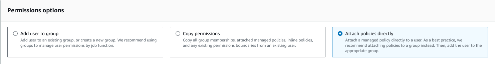
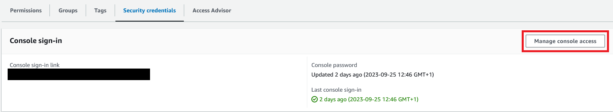
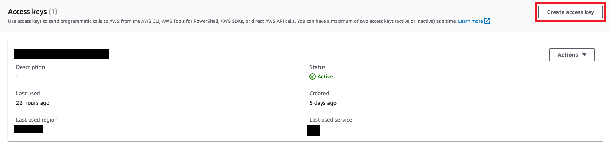
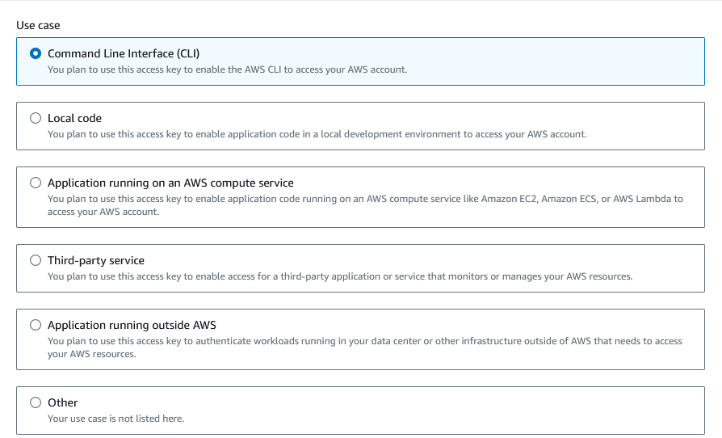
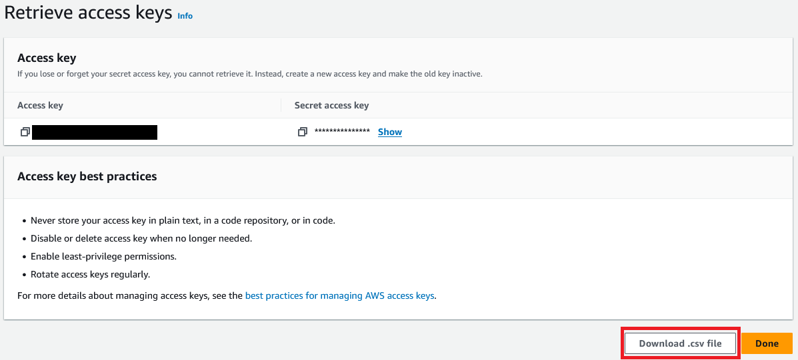

# Technical Manual - Industrial Project - Team 2

>## Contents 
> - [Prerequisites](#prerequisites)
> - [Pipeline Setup](#pipeline-setup)
>   - [AWS](#aws)
>   - [Encryption Key](#encryption-key)
>   - [GitHub Repository](#github-repository)
> - [Sources](#sources)
>  

## Prerequisites
1. Create an [AWS](https://link-url-here.org) account.
2. If it's not setup already, create a [GitHub](https://github.com/) account and fork this repository.
3. Download the [Terraform CLI](https://www.terraform.io/) and add to the repository's working directory.
--------------------------------------------------------------------------------
## Pipeline Setup

### AWS
1. Goto the IAM console and select the `Users` section.
2. Create a new user and give it a meaningful name.
3. Afterwards, click on the new user's name and in the `Permissions` tab, select `Add permissions`:

Under the `permission options` section select `Attach policies directly`.

>

Then select `AdministratorAccess`, `IAMFullAccess` and `PowerUserAccess`, and press `Add Permissions` to confirm.

4. Select the `Security credentials` tab and give this user console-access.

> 

5. Create an access key tied to this user. 
> 

Select the `Command Line Interface (CLI)` option.

> 

Give it a meaningful description tag value.
 
Make sure to download the csv file provided as that contains the ID and key pair for the access key that has been created, these will be needed for our GitHub repository secrets.

> 
>   
-----------------------------------------------------------------------------
### Encryption Key
This is fairly simple you may either some random text or what you could do is hash a string with a hashing algorithm like `sha256` or `sha512`. This will be stored as GitHub repository secret.

You may use this [sha512 generator website](https://sha512.online/), or some in-house tool to create your own key.

-----------------------------------------------------------------------------
### GitHub Repository 
Within the GitHub repository go to `Settings > Secrets and variables > Actions` and create a few secret variables.

| Variable Name | Value |
| -------- | ------- |
| `AWS_ACCESS_KEY_ID` | Access key ID from the downloaded `csv` file. |
| `AWS_SECRET_ACCESS_KEY` | Secret access key from the downloaded `csv` file. |
| `ENCRYPTION_KEY` | The key generated or made from the [previous step](#encryption-key). |
-----------------------------------------------------------------------------

## Pipeline Usage
The CI/CD pipeline only works upon opening a pull request and merging branches, to do so:
1. Create a new branch or go to pre-existing branch that is not `main`/`master`.
2. Push one or more commits to that branch afterwards create a new pull request.
   - Upon creation the pipeline automatically starts running and runs the necessary tasks to validate and plan the underlying terraform code.
3. Once branch merging starts the next steps of the pipeline trigger where the terraform infrastructure code is deployed to AWS and a script also runs afterwards to test the deployment.

## Sources

 ### <u>GitHub Actions Workflow</u>
 > #### Checkout: 
 > https://github.com/actions/checkout/tree/v3/
 > https://github.com/actions/checkout/tree/v2/
 >
 > Date Accessed - [01/10/2023]

 > #### Setup Terraform:
 > https://github.com/hashicorp/setup-terraform/tree/v1/
 >
 > Date Accessed - [01/10/2023]

 > #### Configure AWS CLI:
 > https://github.com/aws-actions/configure-aws-credentials/tree/v1/
 >
 > Date Accessed - [01/10/2023]

 > #### Upload GitHub Artifact:
 > https://github.com/actions/upload-artifact/tree/v2/
 >
 > Date Accessed - [01/10/2023]

 > #### Download GitHub Artifact:
 > https://github.com/dawidd6/action-download-artifact/tree/v2/
 >
 > Date Accessed - [01/10/2023]

 > #### Comment on Pull Request:
 > https://github.com/thollander/actions-comment-pull-request/tree/v2/
 >
 > Date Accessed - [01/10/2023]