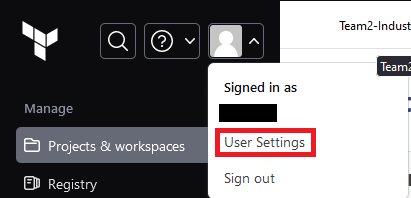
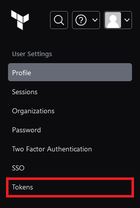

# Technical Manual - Industrial Project - Team 2

>## Contents 
> - [Prerequisites](#prerequisites)
> - [Pipeline Setup](#pipeline-setup)
>   - [AWS](#aws)
>   - [Terraform Cloud](#terraform-cloud)
>   - [GitHub Repository](#github-repository)
> - [Sources](#sources)
>  

## Prerequisites
1. Create an [AWS](https://link-url-here.org) account.
2. Create a [Terraform Cloud](https://app.terraform.io/session) account.
3. If it's not setup already, create a [GitHub](https://github.com/) account and fork this repository.
4. Download the [Terraform CLI](https://www.terraform.io/) and add to the repository's working directory.
--------------------------------------------------------------------------------
## Pipeline Setup

### AWS
1. Goto the IAM console and select the `Users` section.
2. Create a new user and give it a meaningful name.
3. Afterwards, click on the new user's name and in the `Permissions` tab attach the following policies:
   - policy1
   - policy2
4. Select the `Security credentials` tab and give this user console-access.
   - This part will be used later when deploying kubernetes as this allows to view the nodes on the cluster.
> 

5. Create an access key tied to this user. 
> 

Select the `Command Line Interface (CLI)` option.

> 

Give it a meaningful description tag value.
 
Make sure to download the csv file provided as that contains the ID and key pair for the access key that has been created, this will be needed in the next section.

> 
>   
-----------------------------------------------------------------------------
### Terraform Cloud
1. Once an organization has been created add a new workspace to the organization.
2. In the workspace go to `Variables > Workspace Variables` and:
    - For both variables select the environment category.
    - Create a new variable and name it ``AWS_ACCESS_KEY_ID`` for the value enter the key ID from the csv file provided.
    - Create a new variable and name it ``AWS_SECRET_ACCESS_KEY`` for the value enter the secret access key from the csv file provided.
      - Set this variable to sensitive. 
3. Create an API Token.
   
   Enter the user settings menu and go to the "Tokens" section.
   > 
   >
   > 

   Press the "Create an API Token" button.
    -  Give it a meaningful description.
    -  Set an expiry date for as long as required.
    -  Once it is created make sure the key provided has been copied and stored somewhere temporarily as it will be used in the next section and properly discarded after it has been added to the GitHub Repository as a secret.
-----------------------------------------------------------------------------
### GitHub Repository 
1. Within the GitHub repository go to `Settings > Secrets and variables > Actions` and create a new secret variable, this variable will be the API token created in the Terraform Cloud.
   - Give it the name `TF_API_TOKEN`.
   - The value will be the key that has been created earlier in the Terraform Cloud.

-----------------------------------------------------------------------------

## Sources

> > ### GitHub actions with Terraform Cloud for AWS: 
> >https://developer.hashicorp.com/terraform/tutorials/automation/github-actions#prerequisites
> >
> >Date Accessed - [27/09/2023]
> 
> > #### GitHub actions workflow file source
> > This is where the `.github` folder in this repository is from.
> > https://github.com/hashicorp-education/learn-terraform-github-actions
> >
> > Date Accessed - [27/09/2023]
> 
>   